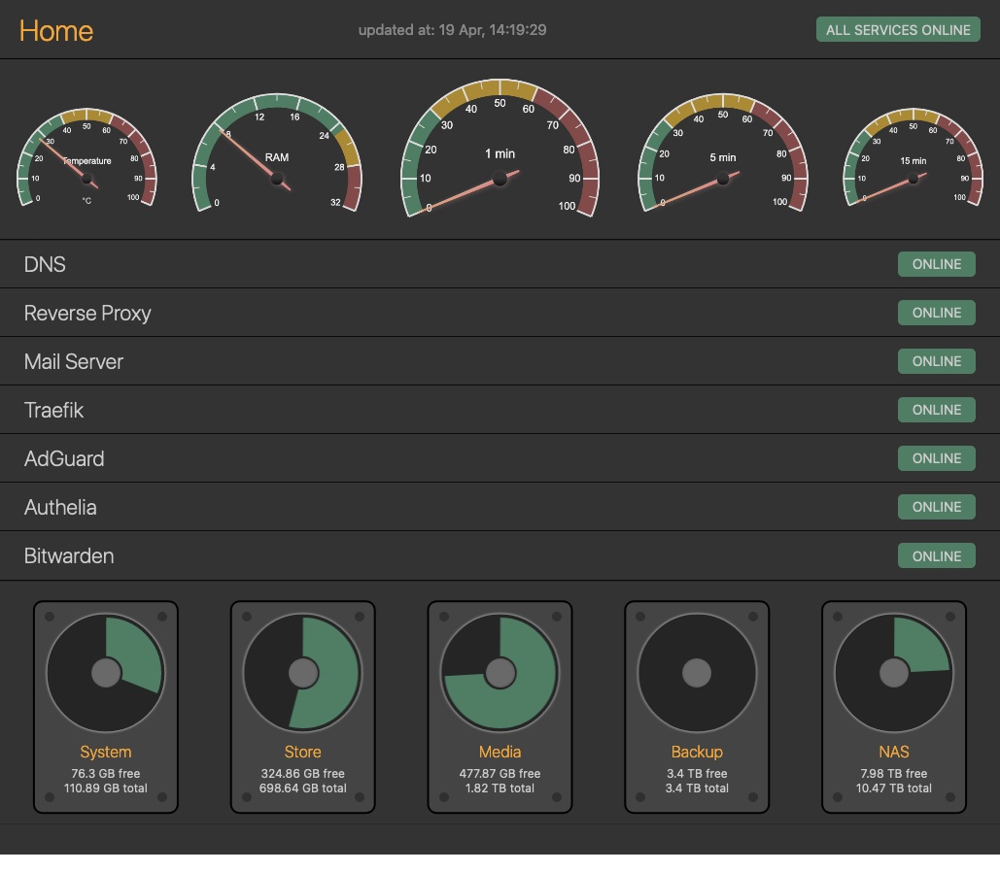

# SerMon
Extremely simple Server Monitor in a docker container.

### TODO - Next
- [x] move all data to store
- [x] make server run periodically (e.g. every 3 - 5 sec)
- [x] add service summary (5 online, 1 offline) at the top
- [x] logo/icon
- [x] add `du` for /dev/sd* (as progressbars)
- [x] notifications & alerts
- [ ] Allow to configure data displayed (e.g. gauges) based on the configured data sources

#### TODO - Backlog
- [ ] log data in a db of sort
- [ ] show historical data (ping times, uptime)
- [ ] replace config with edit page

### 3rd party libs
- [gauges](https://canvas-gauges.com/)
